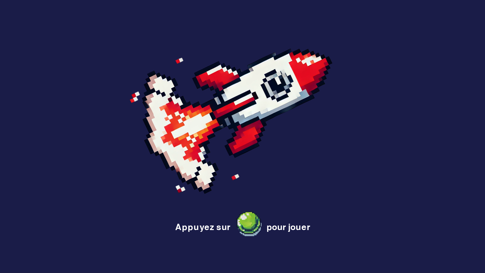
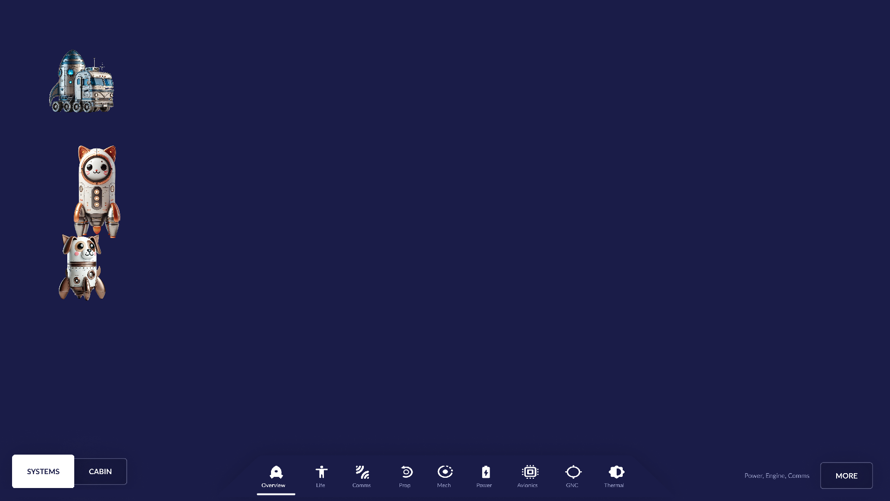
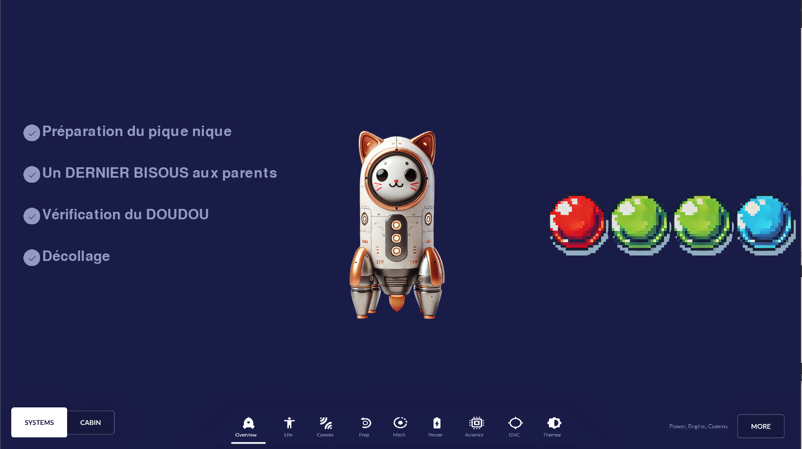
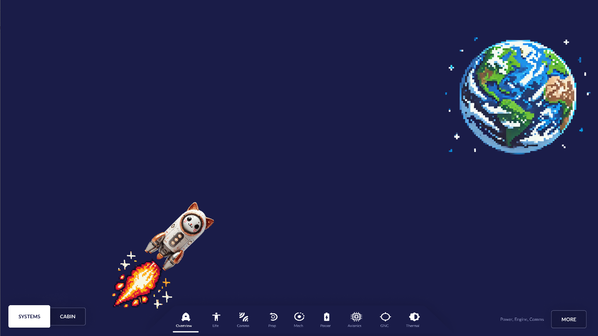
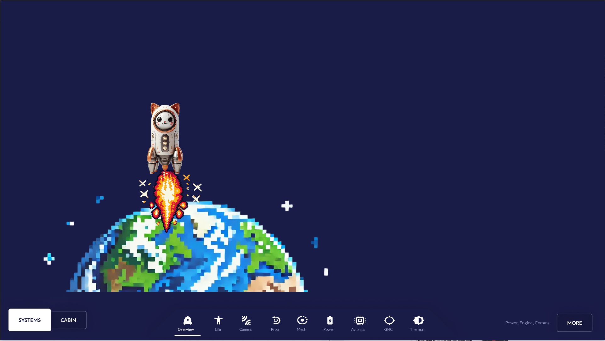
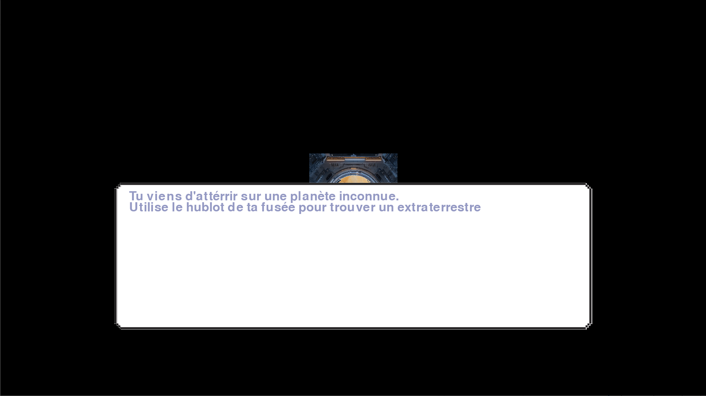
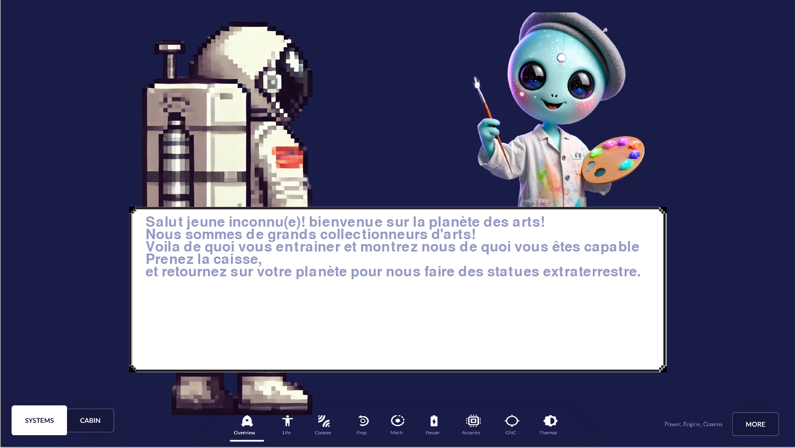

# 🎉 Birthday Arcade Game 🎮

|  


**Quick & Dirty project** developed for my daughter's birthday.  
The game is designed to be used with an **arcade joystick and buttons**.

## 📸 Galerie d'images

|  |  |  |
|-----------------------------------------------|-----------------------------------------------|-----------------------------------------------|

|  |  |  |
|-----------------------------------------------|-----------------------------------------------|-----------------------------------------------|

|  |  |  |
|-----------------------------------------------|-----------------------------------------------|-----------------------------------------------|

## 🕹️ Concept
Each scene is a fun pretext where the child collects items that will be used in the next activity.  
The project was completed in **one week** and is technically my **first game**.  
The code is far from perfect, but it did the job for the birthday — and most importantly, **the kids had fun**!

## ⚙️ Platform Notes
- Initially tested on a **Raspberry Pi 4** — performance was laggy (probably due to unoptimized code).
- I also noticed strange behavior on the Pi: the fog of war (black on Windows) appeared **transparent**.
- In the end, I ran the game on my **development machine** — everything worked fine and the children were happy!

## 🎨 Assets
- **Images** generated using **ChatGPT** and **Midjourney**.
- Useful tool for removing backgrounds:  
  👉 [https://www.photoroom.com/tools/background-remover](https://www.photoroom.com/tools/background-remover)
- Background source is: https://www.figma.com/community/file/855715967691534013/spacex-crew-dragon-flight-control-ui 

## 🔊 Voices
- **Voice lines** generated with [https://elevenlabs.io](https://elevenlabs.io).
- To download the generated audio:
  1. Press `F12` to open the **developer console**.
  2. Go to the **Network** tab.
  3. Look for the **POST** request containing the audio.
  4. Copy the **response** to a text file.
  5. Decode it with:
     ```bash
     base64 -d input.txt > output.mp4
     ```
  6. Convert to `.ogg` using **Audacity** or any audio converter.

## ✅ Disclaimer
This project was created quickly for a personal event.  
Expect **messy code** and **minimal optimization** — but it works for the purpose it was built for


# 🎉 Jeu d'Anniversaire Arcade 🎮

**Projet rapide et "brut de décoffrage"** développé pour l'anniversaire de ma fille.  
Le jeu est conçu pour être utilisé avec un **joystick arcade et des boutons**.

## 🕹️ Concept
Chaque scène est un prétexte pour que l’enfant récupère du matériel ou des objets utiles pour l’activité suivante.  
Le projet a été réalisé en **une semaine** et c’est techniquement mon **premier jeu**.  
Le code n’est pas propre, mais l’essentiel était que ça fonctionne pour l’anniversaire — et surtout, **les enfants se sont amusés** !

## ⚙️ Notes sur la plateforme
- Testé initialement sur un **Raspberry Pi 4** — le jeu était assez lent (probablement à cause de mon code non optimisé).
- Comportement étrange observé sur le Pi : le **brouillard de guerre** qui est noir sous Windows était **transparent** sur le Raspberry.
- Finalement, j’ai lancé le jeu sur mon **PC de développement** — tout a fonctionné parfaitement et les enfants étaient ravis.

## 🎨 Ressources graphiques
- **Images** générées avec **ChatGPT** et **Midjourney**.
- Outil très pratique pour enlever les fonds des images :  
  👉 [https://www.photoroom.com/tools/background-remover](https://www.photoroom.com/tools/background-remover)
- La source du fond d'écran est source: https://www.figma.com/community/file/855715967691534013/spacex-crew-dragon-flight-control-ui 

## 🔊 Voix
- **Voix** générées avec [https://elevenlabs.io](https://elevenlabs.io).
- Pour récupérer les fichiers audio :
  1. Appuyez sur `F12` pour ouvrir la **console développeur**.
  2. Allez dans l’onglet **Network** (Réseau).
  3. Repérez la requête **POST** contenant l’audio.
  4. Copiez la **réponse** dans un fichier texte.
  5. Décodez-la avec la commande suivante :
     ```bash
     base64 -d input.txt > output.mp4
     ```
  6. Convertissez le fichier `.mp4` en `.ogg` avec **Audacity** ou un autre convertisseur audio.

## ✅ Remarque
Ce projet a été réalisé rapidement pour un usage personnel et ponctuel.  
Le code est **sale**, **non optimisé**, mais il **fait le job** — et c’est tout ce qui comptait pour l’événement !

---